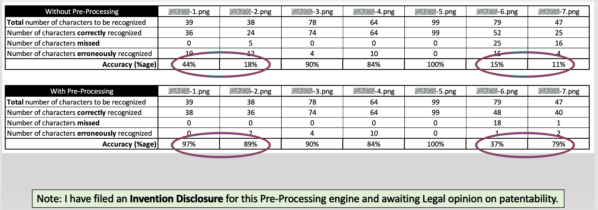

  

# BFSI Automation with OCR
Optical Character Recognition (OCR) plays a very important role in automating business processes, especially in the Banking and Financial Services Industry.  In this PoC, I have used Microsoft's Azure Computer Vision READ API to capture both printed and handwritten text from images.  A Cloud version as well as a Docker version of the READ API have been implemented.

|[Introduction](#introduction)|[Business Opportunity](#business-opportunity)|[Technical Solution](#technical-solution)|[Technical Architecture](#technical-architecture)|[Demo](#demo)|[Contact](#contact)|
|---|---|---|---|---|---|
|   |   |   |[▶︎ Accuracy](#accuracy)|   |   |
|   |   |   |[▶︎ Pre-processing](#pre-processing)|   |   |
|   |   |   |[▶︎ Web App](#web-app)|   |   |
|   |   |   |[▶︎ Security](#security)|   |   |

## Introduction
According to an IDC prediction ([IDC FutureScape 2021 Worldwide Top Ten IT Predictions](https://www.idc.com/events/futurescape)), by 2022 45% of repetitive work tasks in large enterprises will be automated and / or augmented by "digital workers".

  

Digital transformation in BFSI benefits from using OCR to digitize documents such as:
  
  - Customer facing services, such as cheques for remote deposits
  - Details on a credit or debit card
  - Paper applications for insurance, mortgage loans and credit cards:
    - including completed forms once an application is accepted 
  - Paper invoices
  - Paper remittances
  - Know Your Customer (KYC)

For example, at [Citibank](https://www.citi.com), OCR is the first initiative in Ops Automation strategy:

  

To summarize, OCR leads to...
 

  

<a href="#bfsi-automation-with-ocr"></img></a>

## Business Opportunity
A specific business need opportunity has come up wherein a large European Banking group wants to:

  - implement automation of Pay Orders processing with OCR
  - capture account numbers, amounts (with punctuation mark) in Pay Orders 
  - Pay Orders contain printed and handwritten text, both in English and European languages.
  
## Technical Solution
After testing out various OCR solutions like AWS Textract, Google Document.AI, Google Computer Vision and Tesseract, I chose Microsoft's Azure Computer Vision READ API to implement the PoC. [Microsoft's READ API](https://docs.microsoft.com/en-us/azure/cognitive-services/computer-vision/concept-recognizing-text#read-api) is best in class both from technical standpoint as well as offering both Cloud as well as on-prem Docker options.

The solution involves pre-processing (more details on this [below](#pre-processing)) an image, submitting it to READ API for processing and post-processing the output from READ API which returns a JSON structure of extracted text along with their rectangular coordinates.

  

<a href="#bfsi-automation-with-ocr"></img></a>

## Technical Architecture
From an architecture standpoint, the Cloud version of the PoC is completely hosted in Azure.  The images to be processed are stored in a secure Azure Storage Blob Container.  The URL of the stored image is passed to a Serverless function which performs pre-processing before submitting it to READ API.  On successful processing, READ API returns a JSON structure with all the extracted text along with the rectangular coordinates where the text resides.  In the post-processing step, I am overlaying the extracted text information on the original image with a rectangular box and storing it securely in a Azure Storage Blob Container.  The URL of the post-processed image is added to the JSON structure which is returned back.

  

<a href="#bfsi-automation-with-ocr"></img></a>

### Accuracy
For calculating the accuracy of the OCR engine, I came up with a quantitative empirical formula:

  

<a href="#bfsi-automation-with-ocr"></img></a>

### Pre-processing
One challenge I faced when implementing the solution was the vertical lines in boxes present in images.  These vertical lines were treated as "1" by the OCR engine greatly reducing the accuracy.  Pre-processing the images with both commercial and open source solutions (like OpenCV / GIMP / ImageMagik / Hough transformation / Canny Edge detection and removal / Resolution management / Otsu threshold for foreground and background separation) all resulted in even more reduction in accuracy.

So, I ended up writing a small custom pre-processing routine to remove the vertical lines in images.  Below is a comparison of OCR accuracy without and with pre-processing:

  

### Web App
To showcase the Cloud version of the solution, I have developed a web app and for security, integrated this solution with Office 365 SSO authentication and Symantec MFA.  To further enhance security, the webapp is accessible only to authorized users - please drop a note to [me](mailto:svaidyan_signup@hotmail.com) if you don't have access.

### Security
Since BFSI data is very sensitive, following security precautions have been incorporated:

  - Website access is integrated with Office 365 SSO authentication and Symantec MFA
  - Website access is available only to authorized users
  - Office 365 authentication token is returned back only to authorized endpoints of my app
  - API access to serverless function is controlled via a confidential function key
  - Microsoft restricts API calls to READ API only to registered secure subscriptions
  - Images are stored in secure, private Azure Blob Containers.

<a href="#bfsi-automation-with-ocr"></img></a>

## Demo
A demo video comprising walk through of both the Cloud as well as Docker versions of the PoC is here:

## Contact
Please drop a note to [Vaidya](mailto:svaidyan_signup@hotmail.com).

<a href="#bfsi-automation-with-ocr"></img></a>
